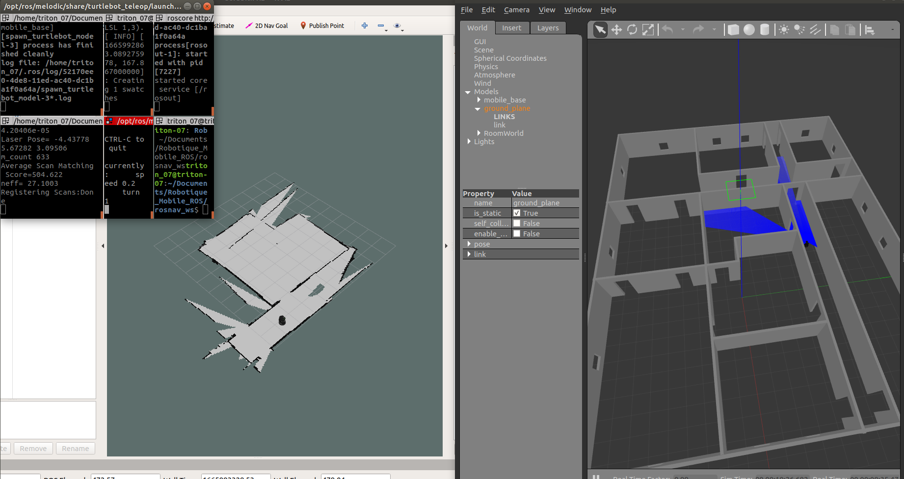
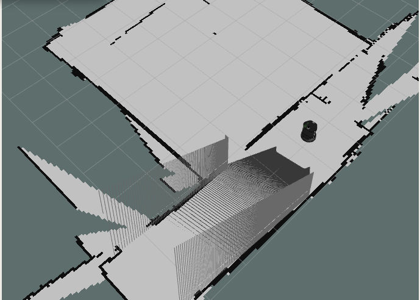
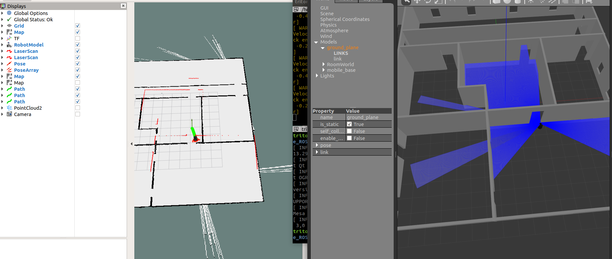
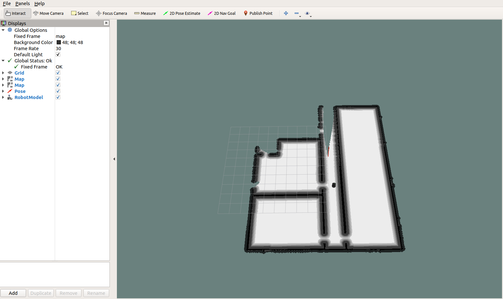
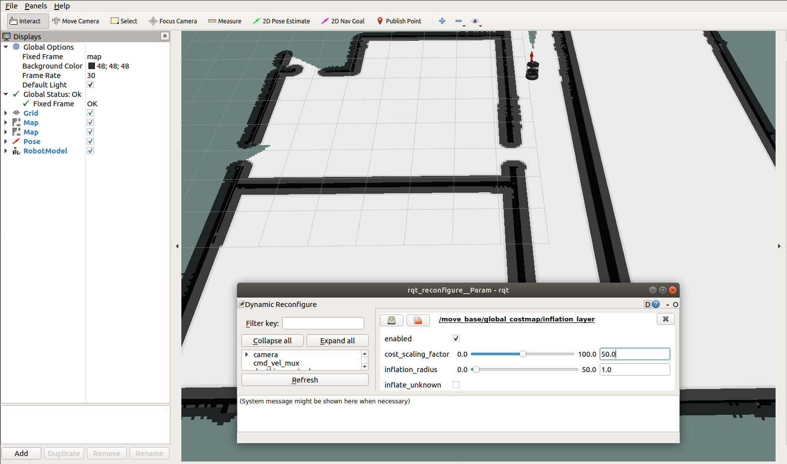
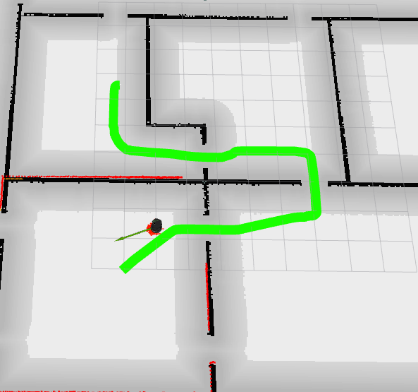
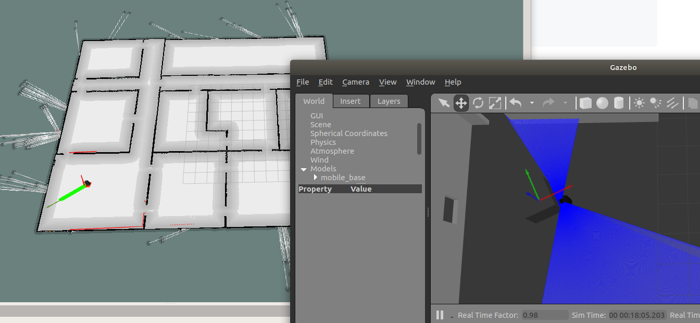
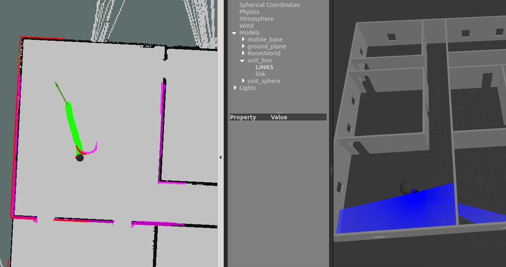
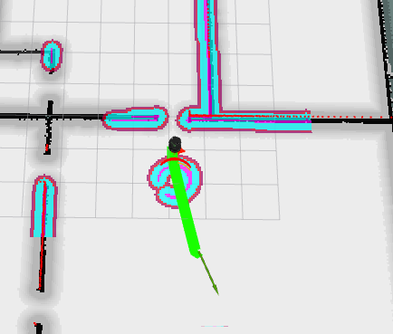

# ROS Navigation Tutorial

## 1. Start Simulation and Mapping

### 1.3 Map the environment

What happened when the robot move ? Why ?
>Quand le robot se déplace, le laser touche les murs et la map se crée

What happened when your robot tries to map a long corridor ?
>Le robot détecte les murs du couloir dans la limite de la range du laser. Quand le robot va longer le mur d'un long couloir, la map crée est décalée (elle n'est pas droite) par rapport au sens de la map. 

>Si on heurte un mur, on va avoir un shift de la map, un décalage et on va etre oblige de reculer et de replacer le robot en tournant sur lui meme pour qu'il corrige l'erreur.

>Quand on heurte le mur, le robot sur rviz continue d'avancer (il recoit toujours les donée d'odométrie) et au bout d'un moment, il se rend compte en comparant avec les données de capteurs laser qu'il est bloqué et se replace. Par contre cela créé un décalage sur la map, qu'il faut corriger en remappant l'espace alentour de façon clair.


### 1.4 Map files

Open the myMap.yaml and explain each lines
```yaml
image: myMap.pgm
resolution: 0.050000
origin: [-6.900000, -5.900000, 0.000000]
negate: 0
occupied_thresh: 0.65
free_thresh: 0.196

```

image:
> Path de l'image de la map

resolution:
> Résolution de la map (mètres/pixel)

origin:
> Position 2D du pixel le plus bas à gauche de la map

negate:
> Peut valoir 0 ou 1, permets d'inverser occupied_thresh et free_thresh

occupied_thresh:
> L'espace occupé sur la map (murs, robots, obstacles...)

free_thresh:
> L'espace libre sur la map (là où le robot peut se déplacer)

### 1.5 Change observation source

What do you observe ? Why ?
> Beaucoup moins de precision sur la kinect, on a des jumps quand le robot ne trouve plus de point de repere et pense au'il n'a pas avancé. La carte est beaucoup moins clair, il faur rouler plus doucement, pour ne pas avoir de décalage.

>La kinect voit aussi moins loin, les ifnormations remontée sont beaucoup plus bruité car le capteur de moins bonne qualité que le laser.

  

On a ci-dessous le mapping avec le nuage de point de ce que voit le capteur.

  


## 2. Start simulation env.

What happened when the robot tries to cross a door ? Why ?

> Il n'arrive pas a traverser la porte, et il va se prendre le mur. On a un décallage sur Rviz, ou il croit avoir passé la porte alors que non. On le voit bien sur l'image ci-dessous.

  


> L'algo de navigation du robot l'assimile a un point. Qunad il essaye de passer la porte, il ne peut pas car il va vouloir passer au plus proche du mur et il va percuter le mur de l'epaisseur de son rayon. Pour régler ce probleme, on doit inflate les obstacle de au moins le rayon du robot.

## 3. Inflate layer

### 3.2 Add an inflate layer

Find the definition of each parameter:

- Global parameters:
    - robot_radius : radius of the robot use to compute cost into inflate layer (refer to inscribed_radius)
    - map_type: type of map used to compute path (voxel)
- Static layer
    - Layer regroupant les infos statique de la map et des obstacles aui ne changereont pas
- Inflation layer
    - Layer regroupant les données d'inflation, permettant au robot d'éviter les obstacles. Cette layer integre des notions de cout, qui indiaue la proximite du robot avec un obstacles et les probabilités de collisions associées.
    

What happened with the new configuration ? Explain the different robot trajectories ?

> La trajectoire du robot est plus fluide, il arrive a passer les portes et ses trajectoires sont plus interessante. Par contre, on est pas forcément parfait a chaque fois, il va encore heurter les mur lors de passage de porte a des moments. On devrait pouvoir adapter les valeur de la costmap pour affiner les trajectoires. on la costmap ci-dessous:



### 3.2 Impact of inflate layer parameters on navigation path

En modifiant les valeurs du cost_scaling_factor et de l'inflation radius, on modifie la pente et le cout des mouvement du robot. Cela va avoir un impact sur sa trajectoire. Pour avoir une trajectoire la plus optimisée, il faut trouver le juste equilibre entre ces 2 facteurs, pour que le robot reste en sécurité (pas de risque de collision) et que sa trajectoire soit la plus optimisée.



On peut voir ci dessous, la trajectoire aue prend le robot avec une certaine vaelur de coefficient sur l'inflation layer.



Si on ajoute un obstacle et qu'on envoie le robot dans sa direction, il ne va pas le prendre en compte dans sa costmap, la trajectoire va passer a travers et il va y avoir collision. Le robot lui, voit bien l'obstacle mais ni le local planner ni le global planner ne prennent en compte un obstacle qui n'est pas placé au préalable.



## 4. Obstacle layer

### 4.2 Add an obstacle layer

Find the definition of each parameter :

- obstacle_layer:
- combination_method
- ObstacleCostmapPlugin
    - track_unknown_space
- Sensor management parameter
    - observation_sources: Liste d'observation de nom de source. (séparé par des espaces)
    - max_obstacle_height: la hauteur maximale de lecture d'un capteur qu'on considere valide.
    - obstacle_range: la distance max (en m) a laquelle on insere les obstacles ds la costmap via les infos capteurs.
    - raytrace_range: la distance max (en m) a laquelle on trace les obstacles de la map en utilisant les données capteurs.
- VoxelCostmapPlugin
    - origin_z: origin z de la map
    - z_resolution : la resolution z de la map en metre/cellule
    - z_voxels: nbr de voxel (valeurs ds une grille 3D) dans chaque colonne verticale. 
    - unknown_threshold: nbr max de cellule inconnu dans unecolonne "connue"
    - mark_threshold: le nbr max de cellule marquée qui peuvent etre dans une colonne considérée libre.
    - publish_voxel_map: si oui ou non on publie la map de voxel (pour visualisation)

### 4.3 First test of the obstacle layer

Try to send an order of navigation through rviz. What happen ? Why ?

En placant un objet devant le robot, l'objet est bien ajouté ds la local cost map dur robot. Par contre, aucun inflate n'est mis en place sur l'objet, donc le robt va essayer de le contourner au plus proche, et il va ya avoir collision. On doit ajouter un inflate associé a l'obstacle layer.



### 4.4 Add a custom inflate layer to the local planner



Le global planner ne prend toujours pas en compte l'obstacle comme on peut le voir.